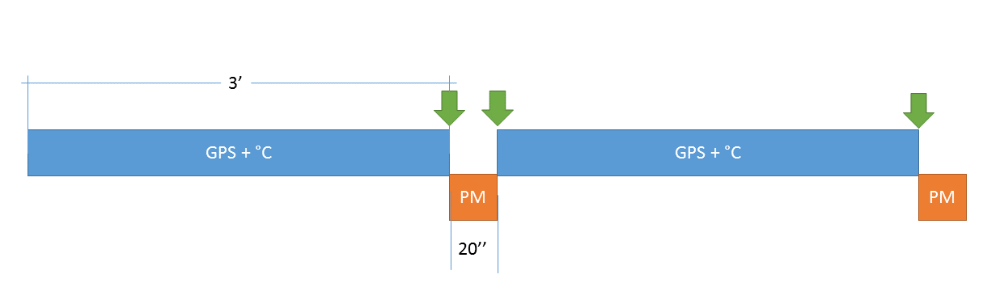
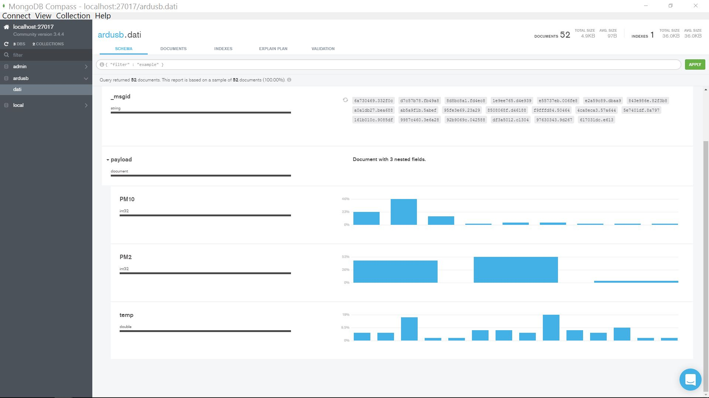
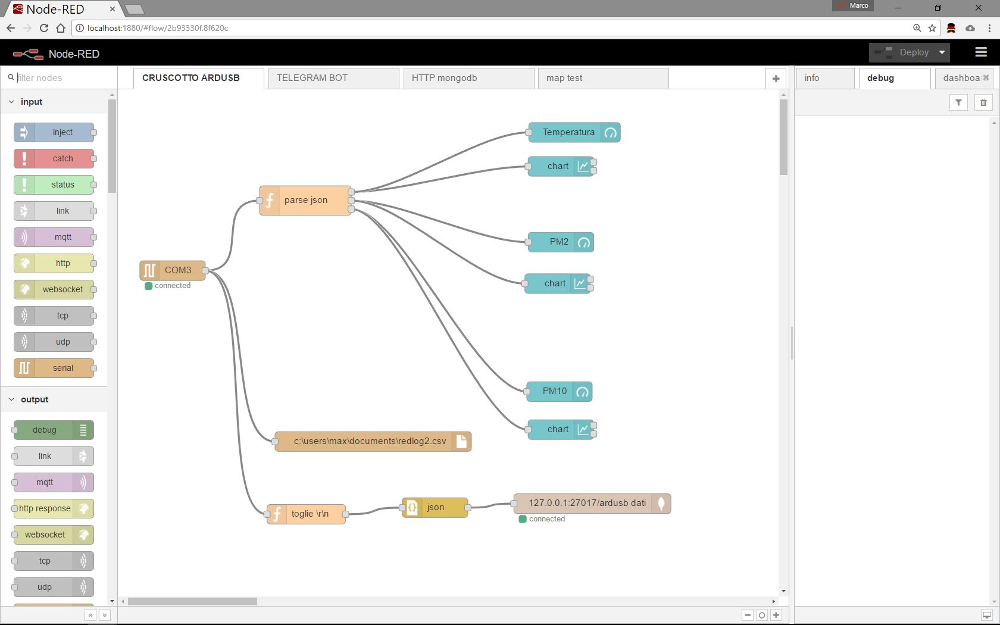

<h1>ARDUSB spazio di studio e test</h1>

Abbiate pazienza per un povero newbie 
nel frattempo mi sto documentando su:

<ul>
<li>GitHub</li>
<li>GitHub pages</li>
<li>JSON</li>
<li>GeoJSON</li>
<li>GeoJSON in Github</li>
<li>GeoJSON in MongoDB</li>
<li>accesso Github a DATA GeoJSON</li>
<li>aggiornare dati su GitHUB da RED</li>
<li>RED node</li>
<li>Arduino UNO hw</li>
<li>Arduino UNO IDE</li>
<li>MQTT</li>
<li>Mosquito MQTT broker</li>
</ul>

TODO/Working list:

<ul>
<li>Parser RED risposta JSON NMEA da arduino</li>
<li>Memorizzazione JSON in MONGODB via RED</li>
<li>Rappresentazione dati in tempo reale in cruscotto RED</li>
<li>Pubblicazione via leafletjs</li>
<li>Implementazione progressiva ulteriori sensori</li>
<li>App Android per la gestione arduino</li>
<li>App Android per l'invio dati arduino</li>
<li><a href="./map.html">Mappa html su Github</a></li>
<li><a href="./mapgjsongithub.geojson">Mappa GeoJSON su Github</a></li>
<li>Associazione delle letture GPS e SDS  Il sensore SDS ha bisogno di almeno 10" per riempirsi di nuova aria e fare un paio di letture. Ho raddoppiato questo tempo.In corrispondenza con le frecce verdi ci sono i momenti in cui è possibile associare le letture della posizione del GPS con quella della qualità dell'aria dell'SDS.Quindi l'ultima lettura GPS è molto prossima alla prima dell'SDS come l'ultima SDS è prossima alla prima lettura di posizione GPS del ciclo successivo<li>
</ul>

sFATTO list:

<ul>
<li>Interfaccia Bluetooth arduino / terminal android</li>
<li>Calcolo temperatura e connessione termistore 503</li>
<li>Gestrione comandi da bluetooth in arduino e risposta</li>
<li>Parser NMEA per GPS VK2828U7G5LF</li>
<li>Risposta JSON arduino</li>
<li>Creazione accesso e token MAPBOX</li>
<li>Collegamento display per controllo in mobilità </li>
<li>Primo cruscotto RED controllo temperatura </li>
<li>Creazione account su MQTT broker https://io.adafruit.com/</li>
<li>Prime letture da SDS011, segue implementazione nel prototipo </li>
<li>Gestione frequenza di campionamento/pausa</li>
<li>Raccolta dei prototipi sw e stesura rel.1.0 Implementazione cruscotto RED  Completare con GPS</li>
</ul>
<li>Creazione db e collezione su MONGODB e popolamento da RED conservando la natura JSON  </li>
<li>Aggiunto campo data e ora nel payload verso mongodb</li>

MATERIALE arrivato:

<ul>
<li>GPS VK2828U7G5LF</li>
<li>Iic/i2c lcd 2004 20*4 lcd 20x4 5 v blu schermo per arduino</li>
<li>Nova pm sensore sds011 laser ad alta precisione modulo sensore di rilevamento di qualità super polvere polvere pm2.5</li>
<li>1602 16x2 HD44780 per arduino LCD Carattere/w IIC/I2C</li>
<li>40 pz in Fila Dupont Cavo 20 cm 2.54mm pin 1 p-1 p Femmina a Ponticello</li>
<li>Alta Sensibilità Microfono Suono Modulo Sensore di Rilevamento Per Arduino AVR PIC</li>
<li>5 V-3 V IIC UART SPI Four Modulo Convertitore di Livello A 4 Canali per Arduino</li>
</ul>

Materiale atteso:

<ul>
<li>micro sd tf card di memoria micro sd spi per arduino shield module</li>
<li>Nuovo Wireless modulo CH340 NodeMcu V3 Lua WIFI Internet of Things ESP8266</li>
<li>DHT22/Am2302 Digitale e Sensore di Umidità</li>
</ul>
